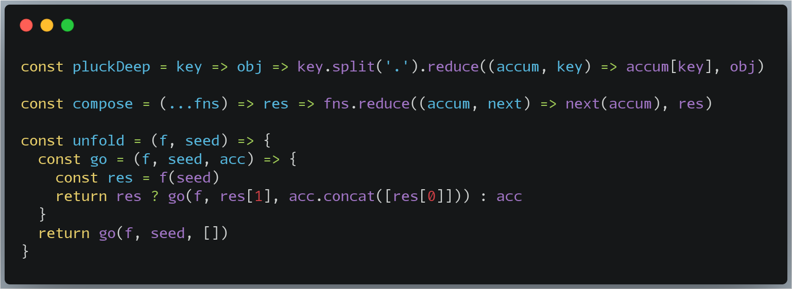
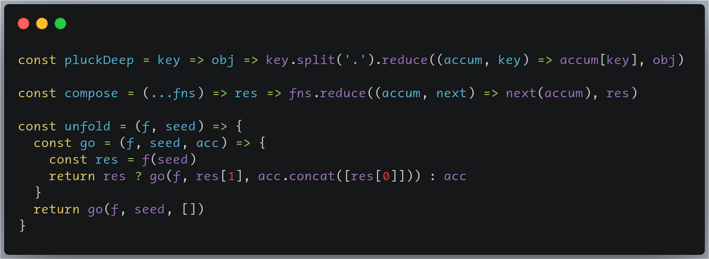

Best fonts for programming

## Fonts
1. Aurulent: it looks like written by Lamy-pen, add missing glyphs from fira code;
2. Consolas: hinted,a better version for Win 7;
3. Droid Sans Mono: Android official monospace font, it is most legible font for reading IMO, so use it for long reading;
4. Fira Code 1.206: medium as bold. You can get italic style from [github.com/zwaldowski/Fira](https://github.com/zwaldowski/Fira/tree/zwaldowski/mod-new);
5. M+ font: cool font for terminal, download from [here](https://zh.osdn.net/frs/redir.php?m=tuna&f=mplus-fonts%2F62344%2F063-WITHOUT_KANA_AND_KANJI.tar.xz);
6. SF Mono: the new macOS default monospace font after Monaco and menlo;
7. Source Code Pro: medium as regular, the medium looks like written by art fountain pen, the official default hint is really beautiful on Windows;
8. TheSans: the sans mono font italic is really beautiful. wish you like it.
8. Liberation Mono: it has 2700+ glyphs, version 2.00.3 is last version has vertical "l";(removed,roboto mono maybe better).

Tips: use the unhinted font when your monitor screen has high ppi(>2K).

## Screenshots
Aurulent

TheSans

!!! The copyright of all these fonts belongs to their authors!
